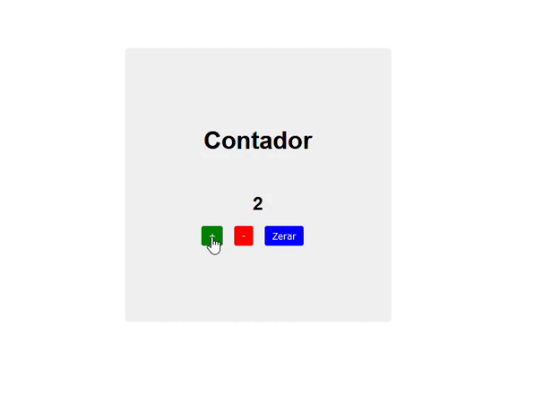

# Counter

 
 
 - Contador em ReactJS
 - Projeto construído durante o curso PROPROFISSÃO.
 - Aumente e diminua valores.

## Acesso 👨🏻‍💻
 [Clique aqui para acessar! :)](https://counterjs-fellype.vercel.app/)

## Tecnologias 👾
- HTML
- CSS
- ReactJS
- Git e Github

## Contato
[(LinkedIn)](https://www.linkedin.com/in/fellype-oliveira-920699230/)
-----
fellypeoliveira2020@gmail.com
